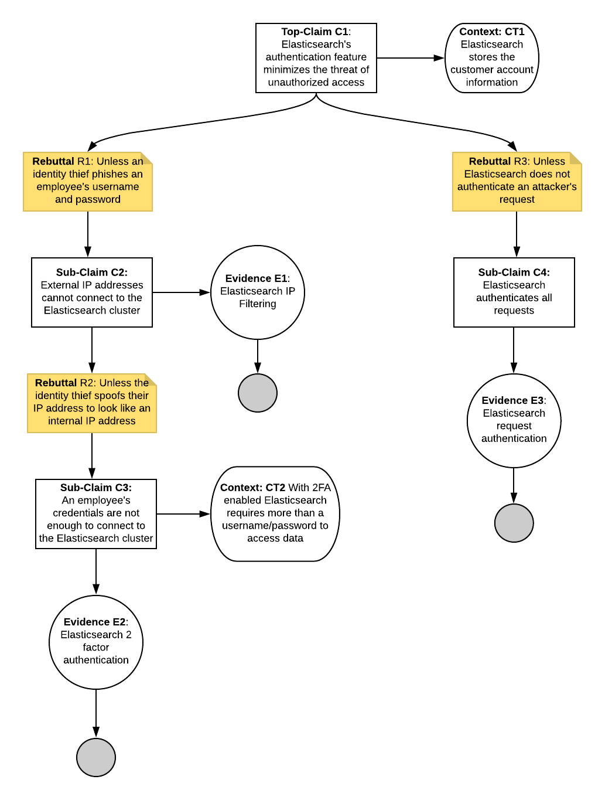

# Assurance Case 1
**Assurance Case:** Elasticsearch's authentication feature minimizes the threat of unauthorized access.

  

**Assessment:**
| Evidence  | Description          | Availability  |
| --------- | -------------------- | ------------ |
| *E1* - Elasticsearch IP Filtering | Required to prove C2 - Documentation needed to prove Elasticsearch can be configured to filter out requests based on IP Address | **Pass** - [IP Filtering](https://www.elastic.co/guide/en/elasticsearch/reference/current/ip-filtering.html) can be configured |
| *E2* - Elasticsearch 2 Factor Authentication | Required to prove C3 - Documentation needed to prove Elasticsearch can be configured to enable 2 Factor Authentication | **PASS** - [2FA](https://www.elastic.co/guide/en/cloud/current/ec-account-user-settings.html#ec-account-security-mfa) can be configured |
| *E3* - Elasticsearch Request Authentication | Required to prove C4 - Documentation needed to prove Elasticsearch authenticates all requests coming in | **PASS** - [Request Authentication](https://www.elastic.co/guide/en/elasticsearch/reference/current/setting-up-authentication.html) happens for all requests |
