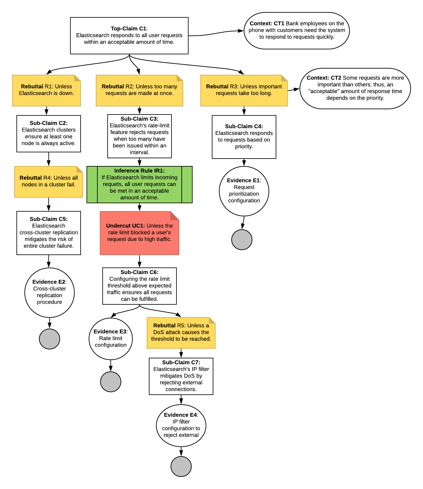

# Assurance Case 1
**Assurance Case:** Elasticsearch's authentication feature minimizes the threat of unauthorized access.

  

**Assessment:**
| Evidence  | Description          | Availability  |
| --------- | -------------------- | ------------ |
| *E1* - Elasticsearch IP Filtering | Required to prove C2 - Documentation needed to prove Elasticsearch can be configured to filter out requests based on IP Address | **PASS** - [IP Filtering](https://www.elastic.co/guide/en/elasticsearch/reference/current/ip-filtering.html) can be configured |
| *E2* - Elasticsearch 2 Factor Authentication | Required to prove C3 - Documentation needed to prove Elasticsearch can be configured to enable 2 Factor Authentication | **PASS** - [2FA](https://www.elastic.co/guide/en/cloud/current/ec-account-user-settings.html#ec-account-security-mfa) can be configured |
| *E3* - Elasticsearch Request Authentication | Required to prove C4 - Documentation needed to prove Elasticsearch authenticates all requests coming in | **PASS** - [Request Authentication](https://www.elastic.co/guide/en/elasticsearch/reference/current/setting-up-authentication.html) happens for all requests |

# Assurance Case 2

**Assurance Case:** The web portal minimizes information disclosed during communication.

**Assessment:**

| Evidence |  Description | Availability | 
|---|---|---|
| *E1* - Elasticsearch SSL/TLS encryption  | Required to prove C2 - Documentation needed to prove Elasticsearch can be configured to encrypt traffic to, from, and within a cluster | **PASS** - [Encryption](https://www.elastic.co/guide/en/elasticsearch/reference/current/ssl-tls.html) can be configured |
| *E2* - Elasticsearch Requires SSL certificate to authenticate new nodes | Required to prove C3 - Documentation needed to prove Elasticsearch can be configured to require SSL certificates for new nodes | **PASS** - [New node SSL Certificate Authentication](https://www.elastic.co/guide/en/elasticsearch/reference/7.9/configuring-tls.html#node-certificates) can be configured |

# Assurance Case 3
**Assurance Case:** Elasticsearch's audit/security logging feature acceptably deters insider threats.

 

**Assessment:**
| Evidence  | Description          | Availability  |
| --------- | -------------------- | ------------ |
| *E1* - Elasticsearch Role Functions | Required to prove C3 - Documentation needed to prove Elasticsearch's role function can be configured to allow restricting actions to certain roles. | **PASS** - The [Role Functions](https://www.elastic.co/guide/en/elasticsearch/reference/current/authorization.html) included in Elasticsearch allow for many different role restrictions including those needed to prove C3. |
| *E2* - Elasticsearch Audit Logging Function | Required to prove C1 - Documentation needed to show that Elasticsearch would allow viewing audit logs in order to determine if there has been deletions. | **WARN** - There is an [Audit Logging](https://www.elastic.co/guide/en/elasticsearch/reference/current/enable-audit-logging.html) feature but more information needs to be found on security event logging. |
| *E3* - Elasticsearch Audit Logging Function | Required to prove C2 - Documentation needed to prove Elasticearch's audit logging feature does not allow for editing or deleting audit logs. | **WARN** - More information needs to be found on elasticsearch's [Audit Logging](https://www.elastic.co/guide/en/elasticsearch/reference/current/enable-audit-logging.html) to confirm there is no way to edit or delete existing logs. |
| *E4* - Elasticsearch Audit Logging Function | Required to prove C4 - Documentation needed to prove Elasticsearch's Audit Logging can be used to discover unwanted actions by insiders. | **PASS** - [Enabling audit logging](https://www.elastic.co/guide/en/elasticsearch/reference/current/enable-audit-logging.html) can be configured in Elasticsearch and comes with many different options. |

# Assurance Case 4
**Assurance Case:** Elasticsearch responds to all user requests witin an acceptable amount of time.

  

**Assessment:**
| Evidence  | Description          | Availability  |
| --------- | -------------------- | ------------ |
| *E1* - Request prioritzation configuration | Required to prove C4 - Documentation needed to prove Elasticsearch can be configured to respond to high priority requests sooner than low priority | **FAIL** - No such feature could be found |
| *E2* - Cross cluster replication procedure | Required to prove C5 - Report needed to prove that cluster can be configured detailing the procedures that will be taken | **PASS** - [Cross cluster replication](https://www.elastic.co/guide/en/elasticsearch/reference/current/xpack-ccr.html) can be configured |
| *E3* - Rate limit configuration | Required to prove C6 - Documentation needed to prove Elasticearch has a configurable rate limit detailing reasoning for the configured threshold | **WARN** - There is a [Rate Limit](https://www.elastic.co/guide/en/cloud/current/ec-api-rate-limiting.html) feature but documentation on configuring thresholds could not be found |
| *E4* - IP filter configuration to reject external | Required to prove C7 - Documentation needed to prove Elasticearch has a configurable IP filter that can reject external IP addresses | **PASS** - There is a highly configurable [IP filter](https://www.elastic.co/guide/en/elasticsearch/reference/current/ip-filtering.html) feature that can be used to suit the business needs |

# Assurance Case 5
**Assurance Case:** Elasticsearch's snapshot and restore feature acceptably supports business continuity in the event of a disaster.

  
**Assessment:**
| Evidence  | Description          | Availability  |
| --------- | -------------------- | ------------ |
| *E1* - Elasticsearch restore snapshot API procedures | Required to prove C4 - Documentation needed to prove Elasticsearch restore snapshot API can restore snapshot of a cluster.  | **PASS** - [Restore a Snapshot](https://www.elastic.co/guide/en/elasticsearch/reference/current/snapshots-restore-snapshot.html) |
| *E2* - Logs of system activity | Required to prove C5 - Documentation needed to prove Elasticsearch logs all activity happening on the system  | **PASS** - [Logs Monitoring](https://www.elastic.co/guide/en/logs/guide/7.9/logs-overview.html) |

# Team Reflection
## [Github Board](https://github.com/npalacio/SoftwareAssurance/projects/3)
- What went well
   - **Collaboration:** Our team all contributed and collaborated well again. We did a good job reviewing each other's work and asking for feedback.
   - **Early Feedback:** We felt reaching out to the professor early on helped us gain an understanding of the assignment better.
- What could have gone better
   - **Starting earlier:** Starting the assignment earlier might have helped us have more time to develop our assurance cases.
   - **Assignment examples:** We felt like some more specific assurance case examples would have helped us better understand what we were supposed to do on this assignment sooner.
- What we want to change moving forward
   - Try to start the assignment sooner.