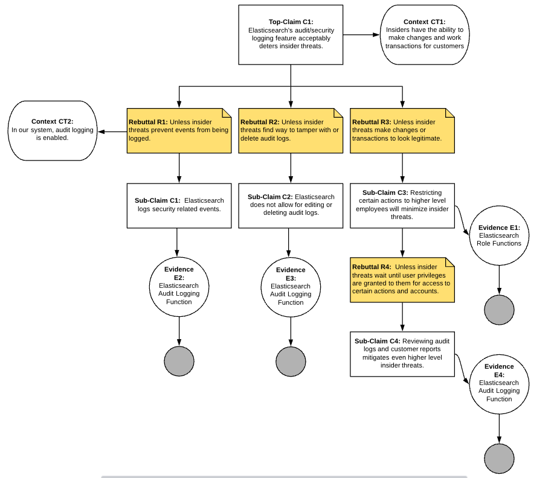

# Assurance Case 3
**Assurance Case:** Elasticsearch's audit/security logging feature (*entity*) acceptably (*value*) deters insider threats (*property*).

 

**Assessment:** The availablility of the required evidence:
| Evidence  | Description          | Availability  |
| --------- | -------------------- | ------------ |
| *E1* - Elasticsearch Role Functions | Required to prove C3 - Documentation needed to prove Elasticsearch's role function can be configured to allow restricting actions to certain roles. | **PASS** - The [Role Functions](https://www.elastic.co/guide/en/elasticsearch/reference/current/authorization.html) included in Elasticsearch allow for many different role restrictions including those needed to prove C3. |
| *E2* - Elasticsearch Audit Logging Function | Required to prove C1 - Documentation needed to show that Elasticsearch would allow viewing audit logs in order to determine if there has been deletions. | **WARN** - There is an [Audit Logging](https://www.elastic.co/guide/en/elasticsearch/reference/current/enable-audit-logging.html) feature but more information needs to be found on security event logging. |
| *E3* - Elasticsearch Audit Logging Function | Required to prove C2 - Documentation needed to prove Elasticearch's audit logging feature does not allow for editing or deleting audit logs. | **WARN** - More information needs to be found on elasticsearch's [Audit Logging](https://www.elastic.co/guide/en/elasticsearch/reference/current/enable-audit-logging.html) to confirm there is no way to edit or delete existing logs. |
| *E4* - Elasticsearch Audit Logging Function | Required to prove C4 - Documentation needed to prove Elasticsearch's Audit Logging can be used to discover unwanted actions by insiders. | **PASS** - [Enabling audit logging](https://www.elastic.co/guide/en/elasticsearch/reference/current/enable-audit-logging.html) can be configured in Elasticsearch and comes with many different options. |