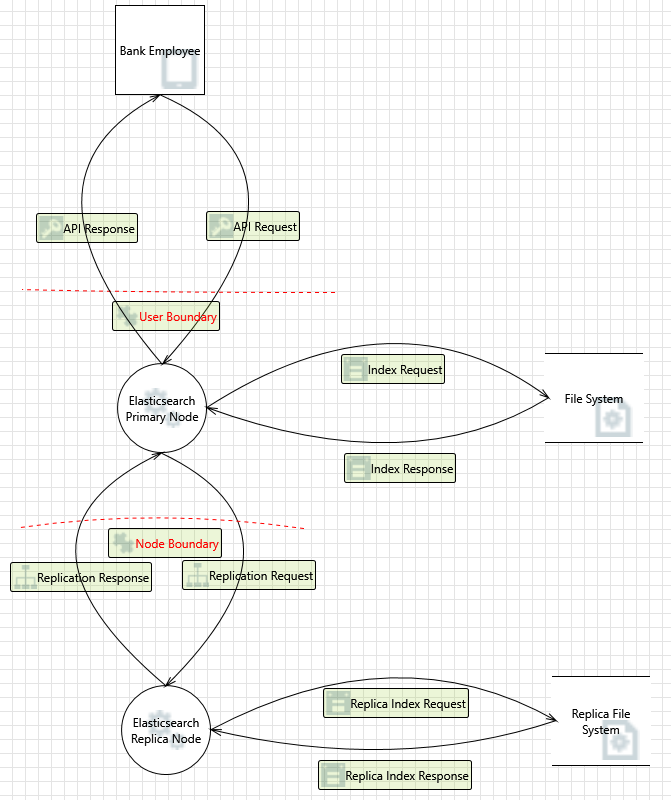

# Part 1
## Scenario

### Bank employee using web client to udpate customer account information stored in an Elasticsearch cluster.

### Data Flow Diagram

### [Full HTML Report](./DFD-CustomerAccountUpdate.htm)

# Part 2
## DFD Threat Analysis

The data flow diagrams provide a high-level visualization of how the Elasticsearch software works within a system to move, store, and manipulate data.  We can analyze threats to the system using Microsoft STRIDE threats to identify design-related issues.  The following are the counts of threats mitigated and needs investigation from the automatically identified threats:

## Threats Migitated

|STRIDE|Count|
|------|-----|
|Spoofing|2|
|Tampering|4|
|Repudiation|10|
|Information Disclosure|3|
|Denial of Service|4|
|Elevation of Privilege|3|

## Needs Investigation

|STRIDE|Count|
|------|-----|
|Spoofing|3|
|Tampering|7|
|Repudiation|1|
|Information Disclosure|1|
|Denial of Service|5|
|Elevation of Privilege|3|

Spoofing could occur in the “Bank Employee” external interactor if a malicious user pretends to be a verified user in order to get sensitive account information.  Tampering with any bits in the system could exist.  For example, if a dataflow contains JSON, JSON processing and hijacking threats may be exploited. Repudiation threats could result from letting everyone write to the logs.  Information disclosure threats appear when looking at who has access to the data in the system and if any of those with access are unauthorized.  Denial of Service threats are related to resource consumption.  Attacks could deadlock the system.  Elevation of Privilege threats could occur if an attacker passes data into the Elasticsearch Replica Node in order to change the flow of program execution.

From our analysis of the automatically generated threats, it seems our biggest gaps in threat mitigation exist in tampering and denial of service.  Tampering threats exist in the API request from the bank employee to the Elasticsearch primary node, the index request from the Elasticsearch primary node to the file system, the index response from the file system to the Elasticsearch primary node, the replica index request from the Elasticsearch replica node to the replica file system, the replica index response from the replica file system to the Elasticsearch replica node, the replication request from the Elasticsearch primary node to the Elasticsearch replica node, and in the replication response from the Elasticsearch replica node to the Elasticsearch primary node.  Since this exists in 7 out of 8 data flows, the design seems particularly vulnerable to tampering threats.  The denial of service threats exist in the API request from the bank employee to the Elasticsearch primary node, exist in the API response from the Elasticsearch primary node to the bank employee, the index request from the Elasticsearch primary node to the file system, the replica index request from the Elasticsearch replica node to the replica file system, and the replication request from the Elasticsearch primary node to the Elasticsearch replica node.  The denial of service threat exists in 5 out of 8 data flows.  As a result, it is reasonable to conclude the design is also particularly vulnerable to denial of service threats.

Elasticsearch threats that are handled well are encrypting communications and authenticating clients to the cluster.  Elasticsearch can be configured to use TLS/SSL for communication between nodes in a cluster and between a client and the cluster. This mitigated several threats related to tampering.  Elasticsearch can be configured to authenticate clients which mitigates several spoofing threats.

Gaps in Elasticsearch security from DFD are cluster/node security, securing log files, changing Elasticsearch execution flow via API requests, and handling issues with replication in a cluster.  ES adds nodes to a cluster using a config file with a list of IP addresses where the other nodes live (https://www.elastic.co/guide/en/elasticsearch/reference/current/important-settings.html#unicast.hosts). There is then a module that handles discovering other nodes in the cluster using this list and its own cluster name setting. If this list were compromised on one node the whole cluster could be compromised by a potentially malicious node being added.  Could not find any documentation on how ES ensures the integrity of its log files.  Unsure if there are ways to send in API requests to an ES cluster that change code execution flow in such a way to elevate the privilege of a user.  Could not find any documentation around what happens when a primary node tries and fails to communicate with a replica node in order to propagate a data change to a replica shard.

In conclusion, I think we have identified several vulnerabilities in our data flow design from a very high level.  I think the DFD threat analysis was helpful but not exhaustive.  The user or designer must speculate and predict all further threats.  It also seems like this analysis is lacking developer level details that would be beneficial for improving the design.  From a developer’s point of view, we have a direction of reducing threats to certain parts of the system.  

# Team Reflection
## [Github Board](https://github.com/npalacio/SoftwareAssurance/projects/4)

- What went well?
  - Meeting with the professor was helpful
- What issues occurred?
  - We had some minor technical difficulties
- How did you resolve them?
  - Resolved them by working together and using google to answer questions
- What did you plan to change moving forward? 
  - Clarify expectations to maintain ability for us to do distributed development
  - Get started earlier
  - No further changes
 

