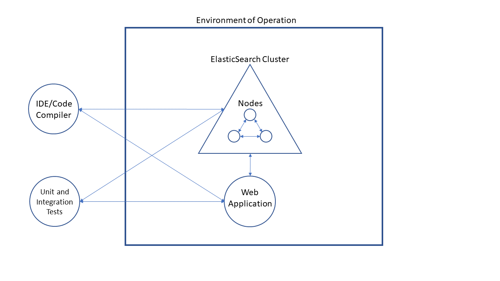

We have selected Elasticsearch as our open source software project to work on this semester.

# Operation Environment
One hypothetical environment where users would expect security functionality from Elasticsearch is in an enterprise environment, for example a bank. A bank could use Elasticsearch to support an internal system that allows users to quickly search for and view customers' account information. The system would need to support fuzzy/partial search functionality where users can put in part of a customer's name or some sort of internal customer ID used by the bank. The system would also need to be able to search across any number of other fields related to a customer that a user might have. The system would need to be able to search across millions of customer records in near real time. The system could look like a user facing web application that is supported by Elasticsearch for the data in the application. This is a perfect use case for Elasticsearch.

Given that there would be personally identifiable information (PII) for customers stored in the Elasticsearch indices the business would want a high level of confidence that this information is safe. The business would want to know that only authorized users of the system would have access to this sensitive customer data. Failure to secure the customer assets in this system could result in a data breach that would cost the company their reputation as a reliable and safe place for customers to give their confidential information to.

The business would also want a high level of confidence that the data stored in Elasticsearch is safe from corruption in the event of a hardware or software failure. Given this requirement the implementers of this system might decide to use multiple nodes inside one Elasticsearch cluster in order to provide redundancy and resiliance to hardware or software failures.

## Threats
- Unauthorized access to customer PII in Elasticsearch
    - A malicious (or non-malicious) user might gain access to customer PII stored in the index. The consequences of that unauthorized access would be severe because it can result in a loss of trust between the customer and the bank.
- A malicious user might attempt to destroy or make the Elasticsearch data unusable.
    - The consequences of this informational loss could be severe if there are no other backups of that data.
- A malicious user might try to modify or update an Elasticsearch index in order to cause unintended behavior in the system.
    - A malicious user with knowledge of the system might try to update or modify an Elasticsearch index in order to cause specific behaviour in the system.
- Unintentional data loss or corruption
    - Data could become corrupt or unusable during normal operation of Elasticsearch due to a severe hardware or software failure.

## Security Features
- User authentication
    - Elasticsearch provides functionality to authenticate users.
- User authorization
    - Elasticsearch provides role based access control in order to provide granular controls over what users have access to. This is done by assigning specific permissions to roles and then putting users into those roles.
- Encrypted communication
    - Elasticsearch provides functionality to encrypt communication between different nodes as well as the consuming system in order to prevent unauthorized access to potentially sensitive information stored in an Elasticsearch index.
- Audit Logging
    - Elasticsearch provides logging so system administrators can monitor things like failed authentication attempts, user access denied, etc.

# Motivation
The primary motivation for choosing ElasticSearch as the subject of our project is a combination of the group member's familiarity with the product and the product's interesting features.

Our team members have utilized this product at work or if not they have utilized Lucene, the open-source search engine software library upon which ElasticSearch is based. ElasticSearch is the most popular enterprise search engine today, which makes sense given the high quality of its search engine, HTTP Web interface, and schema-free JSON documents (which is itself an attractive feature to some members on the team who prefer document style data to flat table, schema based models.) ElasticSearch is a beautiful work of open-source engineering that features the ability to conduct near real-time search while intelligently distributing indices into shards with each shard having zero or more replicas. This model helps to support automatic rebalancing and routing, which in turn support Elasticsearch's performance, scalability and reliability. With all this, it is no wonder that it has such prominent users like Google, Alibaba, AWS, and the European Union.

While all this alone makes Elasticsearch worth learning about, it is especially relevant for our class for the following reason: major use cases for Elasticsearch include security analytics, business analytics, application performance mointoring and infrastructure metrics and container monitoring. All of these are either directly or indirectly relevant to the scope and ethos of our course. It will be our collective pleasure to explore this wonderful product!

# Description
## What is it?
Elasticsearch is an open-source project that functions as a search engine that allows you to store/organize raw data, search for keywords and tags, and analyze this data relatively quickly. Elasticsearch also scales to the larger extremes and is therefore useful in nearly any application or setting that requires storing and retrieving large amounts of information.

The backend componenents of Elasticsearch is made up of nodes, clusters, indexes, document, shards, and replicas. A node represents a single server and is a unit of a cluster, it stores data and has a universal identifier. Clusters allow searching and indexing. 

Documents are the basic units that are indexed in Elasticsearch, and are collected in an index. Indexes can also be divided into multiple shards, each acting as their own index, this also allows for multiple copies of the same document.

## Contributors
Anyone can contribute to Elasticsearch, and the project is managed by Elastic. There are 1,517 contributers at this moment, and there are daily commits.

## Activity/Use
Elastic's website lists uses of Elasticsearch such as application search, website search, enterprise search, logging and log analytics, infrastructure metrics and container monitoring, application performance monitoring, geospatial data analysis and visualization, security analytics, and business analytics.

Elasticsearch works by taking raw data from different sources and parsing it to be usable before creating indexes. From here the data can be searched through and analyzed.

Elasticsearch can also be used in tandem with a separate group of applications in a package called Elastic Stack, which is a combination of Elasticsearch, Kibana, Beats, and Logtash. This allows for storing, formatting, searching, analyzing, and visualizing almost any data.

## Popularity
Elasticsearch seems to have gained significant popularity, as reportedly Uber is one large company that uses it. Other reported companies are Udemy, Shopify, Slack, etc.

## Languages Used
The languages supported by Elasticsearch are Java, JavaScript, Go, .NET, PHP, Perl, Python, and Ruby. Elasticsearch is primarily written in Java.

## Platform
Can be deployed through AWS, Google Cloud, Alibaba Cloud, or through a local system or cloud.

## Documentation Sources
The main website for Elasticsearch is https://www.elastic.co/what-is/elasticsearch, and the github repo is at https://github.com/elastic/elasticsearch. The website that reported companies that use Elasticsearch is here: https://stackshare.io/elasticsearch.

# License
## License Files:
https://github.com/elastic/elasticsearch/blob/master/licenses/APACHE-LICENSE-2.0.txt

https://github.com/elastic/elasticsearch/blob/master/licenses/ELASTIC-LICENSE.txt

## Contribution Files
https://github.com/elastic/elasticsearch/blob/master/CONTRIBUTING.md

https://www.elastic.co/contributor-agreement/

There are two licenses associated with the project.  
The ELASTIC-LICENSE and the APACHE-LICENSE.

## Elastic-License

You cannot disassemble the Elastic Software, prepare derivative works of the Elastic Software Object Code, sell "Elastic Software Object Code, use Elastic Software Object Code for providing time-sharing services or any SAAS offering, cercumvent the limitations on the use of Elastic Software provided to you, and you cannot alter or remove any marks or notices in the Elastic Software.

The Commercial Software may contain or be provided with third party open source libraries.
Elastic hereby grants to You, AT NO CHARGE and for so long as you are not in breach of any provision of this Agreement, a limited, non-exclusive, non-transferable, fully paid up royalty free right and license to the Commercial Software in Source Code format.

You can use a Derivative Work of the Commercial Software outside of a Non-production Environment, transfer, sell, rent, lease, distribute, sublicense, loan or otherwise make available the Commercial Software Source Code.
You may maintain a copy of the repository in which the Source Code of the Commercial Software resides and that copy may be publicly accessible, provided that you include this Agreement with Your copy of the repository.

If you breach any provisions the agreement will terminate and you shall promptly cease the use of the Elastic Software in Object Code format.

Elastic Software is provided without warranty.

Elastic Software is not liable for damages.

## Apache-License

Any contribution you submit to the project is under the terms and conditions of the license.  

The license does not grant permission to use the trademarks of the Licensor.  

There is no warranty.  

No contributor is liable to you for damages.  

If you sell the open-source code, you may act only on your own behalf and on your sole responsibility, not on behalf of any other contributor.

The individual exercising permissions granted by the license is granted a copyright license, and granted a patent license. 

The individual exercising permissions granted by the license is granted rights of redistribution as long as 4 conditions are met:
  1. You must give any other recipients of the Work or Derivative Works a copy of this License
  2. You must cause any modified files to carry prominent notices stating that You changed the files
  3. You must retain, in the Source form of any Derivative Works that You distribute, all copyright, patent, trademark, and attribution notices from the Source form of the Work, excluding those notices that do not pertain to any part of the Derivative Works
  4. If the Work includes a "NOTICE" text file as part of its distribution, then any Derivative Works that You distribute must include a readable copy of the attribution notices contained within such NOTICE file.

## Quick Summary
You can do what you like with the software, as long as you include the required notices. This permissive license contains a patent license from the contributors of the code.

### Can
Use for commercial use, modify, distribute, sublicense, private use, use patent claims, place warranty.

### Cannot
Hold liable, use trademarks, have warranty.

### Must
Include copyright, include license, state changes, include notice.

The contributor must agree with the terms and conditions of the licenses and follow the contribution procedures.

## Procedures for Making Contributions
A contributor can report bugs.

A contributor can put in requests for features.

A contributor can contribute code changes, test your changes, rebase your changes, and submit a pull request.
ElasticSearch uses JAVA.

A contributor must follow Java Language Formatting Guidelines.

A contributor must include License headers on all java files.

A contributor must sign contributor license agreement.

Your contribution will be reviewed to ensure the change is of high quality and fits well with the rest of the Elasticsearch codebase.

If you want to make a contribution as part of a class it is hard to accept a full class of new (most likely short-term) contributors.

# Security History

## Security Features
Elasticsearch contains a robust security feature set. [Configuring Security in Elasticsearch](https://www.elastic.co/guide/en/elasticsearch/reference/current/configuring-security.html) outlines the high-level process to turn on security features. Security features are completely disabled by default for trial and basic licenses; but, they can be turned on with the `xpack.security.enabled` setting. The software can be configured for [FIPS 140-2](https://www.elastic.co/guide/en/elasticsearch/reference/current/fips-140-compliance.html). When using Elasticsearch across distributed systems, inter-node communication can be secured with [TLS](https://www.elastic.co/guide/en/elasticsearch/reference/current/configuring-tls.html). The TLS feature includes all of expected options (specifying certificates, trust stores, supported protocols, and cipher suites). In addition to  built-in user accounts, the software supports user authentication via Active Directory, File, Kerberos, LDAP, Native, PKI, and SAML "realms". Permissions can be assigned to users or bundled in roles providing granular control over indicies, [documents, and fields](https://www.elastic.co/guide/en/elasticsearch/reference/7.3/field-and-document-access-control.html). Lastly, the *Configuring Security in Elasticsearch* guide notes that [Audit Logging](https://www.elastic.co/guide/en/elasticsearch/reference/current/auditing-settings.html) can be enabled. Furthermore, the [Security Settings page](https://www.elastic.co/guide/en/elasticsearch/reference/7.3/security-settings.html) provides full documentation on every security setting. This page illustrates settings in addition to those covered in the configuration guide to configure [anonymous access](https://www.elastic.co/guide/en/elasticsearch/reference/7.3/security-settings.html#anonymous-access-settings), [IP filtering](https://www.elastic.co/guide/en/elasticsearch/reference/7.3/security-settings.html#ip-filtering-settings), and [password hashing](https://www.elastic.co/guide/en/elasticsearch/reference/7.3/security-settings.html#hashing-settings).

## Known Vulnerabilities
The [Security Issues page](https://www.elastic.co/community/security) tracks known vulnerabilities and notes that new discoveries should be sent to security@elastic.co. The page tracks issues for all of "[Elastic's](https://www.elastic.co/) open-source and commercial products". The Elasticsearch section is well-maintained: The most recent disclosure [CVE-2020-7019](https://cve.mitre.org/cgi-bin/cvename.cgi?name=CVE-2020-7019) occurred on August 18, 2020 less than a month before this writing. Two other issues - [CVE-2020-7014](https://cve.mitre.org/cgi-bin/cvename.cgi?name=CVE-2020-7014) and [CVE-2020-7009](https://cve.mitre.org/cgi-bin/cvename.cgi?name=CVE-2020-7009) were noted for Elasticsearch in 2020. Each disclosure provides a vulnerability summary and notes for remediation. For example, the table entry for the latest vulnerability contains the following:

ESA ID | CVE | Date Disclosed | Vulnerability Summary | Remediation Summary
------ | --- | -------------- | --------------------- | -------------------
ESA-2020-12 | [CVE-2020-7019](https://cve.mitre.org/cgi-bin/cvename.cgi?name=CVE-2020-7019) | 2020-08-18 | A field disclosure flaw was found in Elasticsearch when running a scrolling search with Field Level Security. If a user runs the same query another more privileged user recently ran, the scrolling search can leak fields that should be hidden. This could result in an attacker gaining additional permissions against a restricted index. | Users should upgrade to Elasticsearch version 7.9.0 or 6.8.12.

## Security Engineering
The Elasticsearch Github project contains nine security related labels:

Label | Description | Open Issues/PRs
----- | ----------- | ---------------
`:Security/Security`  | *Security issues without another label* | 92
`:Security/Client`  | *Security in clients (Transport, Rest)* | 2
`Team:Security` | *Meta label for security team* | 378
`:Security/Network` | *SSL/TLS, Security for NIO/Netty* | 39
`:Security/Audit` | *X-Pack Audit logging* | 30
`:Security/Authentication` | *Logging in, Usernames/passwords, Realms (Native/LDAP/AD/SAML/PKI/etc)* | 116
`:Security/Authorization` | *Roles, Privileges, DLS/FLS, RBAC/ABAC* | 87
`:Security/License` | *License functionality for commercial features* | 20
`:Security/IdentityProvider` | *dentity Provider (SSO) project in X-Pack* | 0

Taking open issues that contain multiple security labels into account, there are 384 open security-related issues and pull requests at the time of this publication. This represents **13%** of the 2996 open issues.

Previous releases' notes highlight regular security activity (the current version is 7.9):
Release | Security
------- | --------
7.8.0 | [Cert Utils Fix](https://www.elastic.co/guide/en/elasticsearch/reference/7.8/release-notes-7.8.0.html)
7.7.1 | [Authorization Enhancements & Authentication Fixes](https://www.elastic.co/guide/en/elasticsearch/reference/7.8/release-notes-7.7.1.html)
7.7.0 | [New API Creation Feature, Several Auth Enchancements, Security Error Fix](https://www.elastic.co/guide/en/elasticsearch/reference/7.8/release-notes-7.7.0.html#feature-7.7.0)
7.6.2 | [API Key Update](https://www.elastic.co/guide/en/elasticsearch/reference/7.8/release-notes-7.6.2.html)
7.6.1 | [Update oauth2-oidc-sdk to 7.0](https://www.elastic.co/guide/en/elasticsearch/reference/7.8/release-notes-7.6.1.html)
7.6.0 | [Keystore Password Protection](https://www.elastic.co/guide/en/elasticsearch/reference/7.7/release-highlights.html#_password_protection_for_the_keystore), [Roles in Custom Realms, Auth Debug Logging, Several Bug Fixes](https://www.elastic.co/guide/en/elasticsearch/reference/7.8/release-notes-7.6.0.html)
7.4 | [TLS Email Notification Settings](https://www.elastic.co/guide/en/elasticsearch/reference/7.4/release-highlights-7.4.0.html#_tls_settings_for_email_notifications)

# Github Project Board
Our project board can be found [here](https://github.com/npalacio/SoftwareAssurance/projects/1).

# Team Reflection
## What Went Well
- We found success with the way we setup our repository in order to ensure collaboration and review of everyone's work. Specifically, we made `master` our main branch and protected it so that we had to create Pull Requests in order to merge our work into `master`. We had some great collaboration and review in the PR's that we all submitted.
- Everyone on our team contributed. Everyone has been very responsive and engaged on our team which has made things run pretty smoothly.

## What Could Have Gone Better
- We struggled to think of anything for this category but we will put in here that we would like to try to turn the assignment in sooner than the day it is due next time. We were blocked on starting our work as a team until Tuesday of last week because we needed to meet and split up work. We have talked about looking at splitting up work using our group chat in Discord so that we do not have to wait for our synchonous meeting to get started next time.