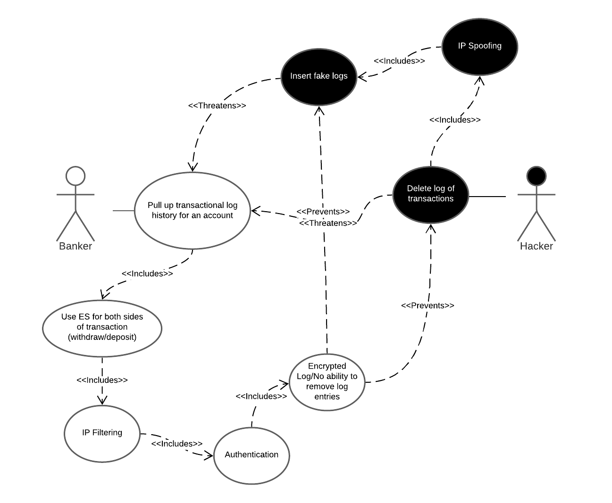

# Use Case 2

**Use Case:** View Customer Account Information

**Description:** Bank employees need to be able to view a customer's account information so that they can properly assist them when they call.

**Misuse Case:** An identity thief will want to try to steal a customer's sensitive informations stored in their account. The identity thief could be an external actor or an internal malicious employee.

**Security Requirements:**
 - Use Elasticsearch [Encrypted Communication](https://www.elastic.co/guide/en/elasticsearch/reference/current/configuring-tls.html) to prevent network eavesdropping.
 - Use Elasticsearch [Document Level Access Control](https://www.elastic.co/blog/attribute-based-access-control-with-xpack) to require a secret phrase that the customer has in order to view their account information.
 - Use Elasticsearch [Role Based Access Control](https://www.elastic.co/guide/en/elasticsearch/reference/current/authorization.html) to require specific permissions that only select employees have in order to view a customer's account information.
 - Use Elasticsearch [Security Logging](https://www.elastic.co/guide/en/elasticsearch/reference/current/enable-audit-logging.html) to detect failed login attempts to see if someone is trying to brute force someone else's credentials.
 
 **Assessment:** Elasticsearch provides the necessary features in order to protect sensitive customer account information from both external and internal identity thieves.

 # Use Case 3

**Use Case:** Accessibility During Business Hours

**Description:** Bank employees require prompt responses from the system during business hours to perform requested actions. Requests must be serviced promptly.

**Misuse Case:** An industrial sabotuer working for a competitor is likely to attempt a Denial-of-Service attack during peak business hours to thwart regular business.

**Security Requirements:**
 - Use Elasticsearch [IP Filtering](https://www.elastic.co/guide/en/elasticsearch/reference/current/ip-filtering.html) to prevent external requests (that are likley part of a probing or DoS attempt)
 - Use Elasticsearch [Rate Limiting](https://www.elastic.co/guide/en/cloud/current/ec-api-rate-limiting.html) to further mitigate DoS attempts including those originating from a compromised internal machine.
 
 **Assessment:** Elasticsearch provides the necessary features to ensure accessibility to resources especially during required times.

# Use Case 4

**Use Case:** Bank Employee updating customer's account info.

**Description:** The bank employee must be able to change information on a customer's account, this info could be personal verifying information of the customer like a name or address, and this also includes financial transactions such as depositing or withdrawing money.

**Misuse Case:** The bad actor in this misuse case is a new hire with malign plans. The new hire could attempt to set the account owner to themself, allowing them access to the money in the account. 

This can be detected through Audit Logging, or prevented by requiring higher level employee access to change the account. The bad actor then decides to wait for this higher level access privilege, but can again be detected/mitigated through audit logging actions of insiders to reduce insider threats.

**Security Requirements:**
[Security Overview](https://www.elastic.co/guide/en/elasticsearch/reference/current/elasticsearch-security.html) gives detailed summaries of security methods included with elasticsearch including unauthorized access and audit logging.

- Use Elasticsearch [Role Based Access Control](https://www.elastic.co/guide/en/elasticsearch/reference/current/authorization.html): Elasticsearch allows for authorizing users, setting roles, and setting privileges and permissions to groups, users, and roles. This allows for preventing users from accessing information a bad actor might misuse.

- Use Elasticsearch [Security Logging](https://www.elastic.co/guide/en/elasticsearch/reference/current/enable-audit-logging.html): Elasticstack (which elasticsearch is a part of) allows for enabling audit logging, which can display failed authentification attempts, failed connections, and provides evidence to help mitigate bad actors' misuse.

**Assessment:** Elasticsearch provides both features that would detect, mitigate, and prevent insider bad actors from having access to tools that would harm customer accounts.

# Use Case 5

**Use Case:** Transactional Log of Transaction History

**Description:** The use case is for a log of all transactions historically that happen in the banks system. This log would include all deposits, withdrawals, transfers, etc. This use case would use ElasticSearch for both sides of the transactions. The use case includes IP filtering as a countermeasure to all tampering with logs. In addition, another use case would be encrypted logs with no ability to remove log entries. 

**Misuse Case:** The misuse cases that would threaten the transactional log would be a hacker deleting the log of transactions, and/or inserting in fake log records.

**Security Requirements:** 
- Use Elasticsearch [IP Filtering](https://www.elastic.co/guide/en/elasticsearch/reference/current/ip-filtering.html) as a counter measure to all tampering with logs.
- Use Elasticsearch [Log Monitoring](https://www.elastic.co/log-monitoring) to monitor all withdraw and deposit transactions.
- Use Elasticsearch [Encrypting Communications](https://www.elastic.co/guide/en/elasticsearch/reference/current/configuring-tls.html#:~:text=Elastic%20Stack%20security%20features%20enable,in%20plain%20text%20including%20passwords.) to encrypt traffic to and from the Elasticsearch clusters.

**Assessment:** Elasticsearch provides the necessary features to ensure secure logging of all transactions in the system.
