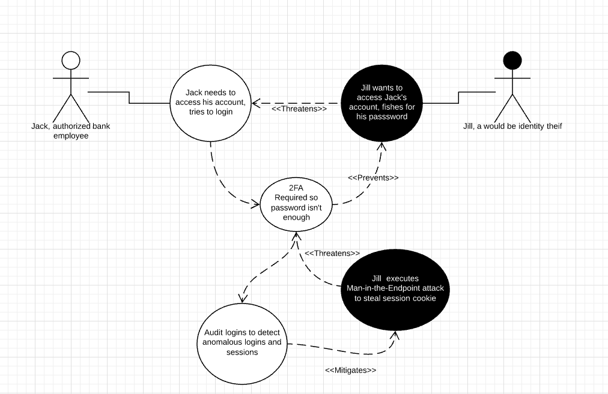
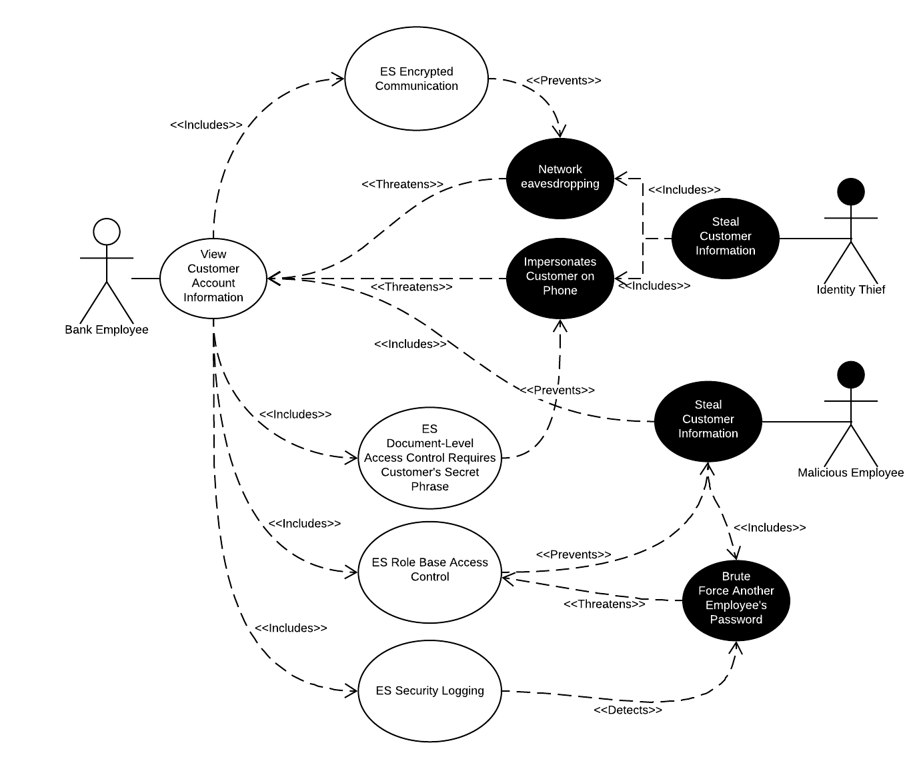
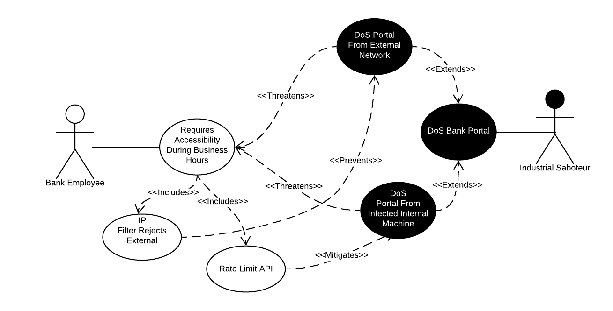
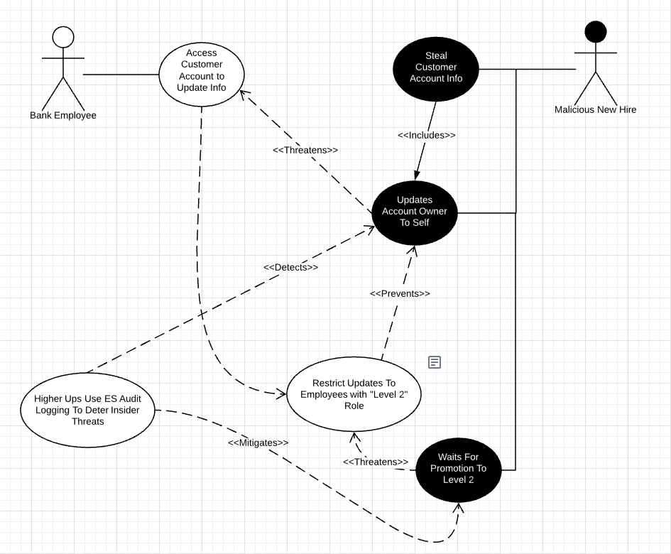

# Use Case 1
  

**Use Case:** Access Employee Account

**Description:** Bank employees need to be able to login to their accounts so that they can perform their job functions.

**Misuse Case:** An identity thief will want to try to steal an authorized users' credentials so they can access the authorized user's account. The identity thief could be an external actor or an internal malicious employee.

**Security Requirements:**
- Use Elasticsearch [2-Factor Authentication](https://www.elastic.co/guide/en/cloud/current/ec-account-user-settings.html#ec-account-security-mfa) to prevent unauthorized users from accessing an account with just the password.
- Use Elasticsearch [Security Logging](https://www.elastic.co/guide/en/elasticsearch/reference/current/enable-audit-logging.html) to detect anomalous logins and sessions.

**Assessment:** Elasticsearch provides the necessary features in order to prevent unauthorized access to employee accounts from both external and internal identity thieves.

# Use Case 2

**Use Case:** View Customer Account Information

**Description:** Bank employees need to be able to view a customer's account information so that they can properly assist them when they call.

**Misuse Case:** An identity thief will want to try to steal a customer's sensitive informations stored in their account. The identity thief could be an external actor or an internal malicious employee.

**Security Requirements:**
 - Use Elasticsearch [Encrypted Communication](https://www.elastic.co/guide/en/elasticsearch/reference/current/configuring-tls.html) to prevent network eavesdropping.
 - Use Elasticsearch [Document Level Access Control](https://www.elastic.co/blog/attribute-based-access-control-with-xpack) to require a secret phrase that the customer has in order to view their account information.
 - Use Elasticsearch [Role Based Access Control](https://www.elastic.co/guide/en/elasticsearch/reference/current/authorization.html) to require specific permissions that only select employees have in order to view a customer's account information.
 - Use Elasticsearch [Security Logging](https://www.elastic.co/guide/en/elasticsearch/reference/current/enable-audit-logging.html) to detect failed login attempts to see if someone is trying to brute force someone else's credentials.
 
 **Assessment:** Elasticsearch provides the necessary features in order to protect sensitive customer account information from both external and internal identity thieves.

 # Use Case 3

**Use Case:** Accessibility During Business Hours

**Description:** Bank employees require prompt responses from the system during business hours to perform requested actions. Requests must be serviced promptly.

**Misuse Case:** An industrial sabotuer working for a competitor is likely to attempt a Denial-of-Service attack during peak business hours to thwart regular business.

**Security Requirements:**
 - Use Elasticsearch [IP Filtering](https://www.elastic.co/guide/en/elasticsearch/reference/current/ip-filtering.html) to prevent external requests (that are likley part of a probing or DoS attempt)
 - Use Elasticsearch [Rate Limiting](https://www.elastic.co/guide/en/cloud/current/ec-api-rate-limiting.html) to further mitigate DoS attempts including those originating from a compromised internal machine.
 
 **Assessment:** Elasticsearch provides the necessary features to ensure accessibility to resources especially during required times.

# Use Case 4

**Use Case:** Bank Employee updating customer's account info.

**Description:** The bank employee must be able to change information on a customer's account, this info could be personal verifying information of the customer like a name or address, and this also includes financial transactions such as depositing or withdrawing money.

**Misuse Case:** The bad actor in this misuse case is a new hire with malicious plans. The new hire could attempt to set the account owner to themself, allowing them access to the money in the account. 

This can be detected through Audit Logging, or prevented by requiring higher level employee access to change the account. The bad actor then decides to wait for this higher level access privilege, but can again be detected/mitigated through audit logging actions of insiders to reduce insider threats.

**Security Requirements:**
[Security Overview](https://www.elastic.co/guide/en/elasticsearch/reference/current/elasticsearch-security.html) gives detailed summaries of security methods included with elasticsearch including unauthorized access and audit logging.

- Use Elasticsearch [Role Based Access Control](https://www.elastic.co/guide/en/elasticsearch/reference/current/authorization.html): Elasticsearch allows for authorizing users, setting roles, and setting privileges and permissions to groups, users, and roles. This allows for preventing users from accessing information a bad actor might misuse.

- Use Elasticsearch [Security Logging](https://www.elastic.co/guide/en/elasticsearch/reference/current/enable-audit-logging.html): Elasticstack (which elasticsearch is a part of) allows for enabling audit logging, which can display failed authentification attempts, failed connections, and provides evidence to help mitigate bad actors' misuse.

**Assessment:** Elasticsearch provides both features that would detect, mitigate, and prevent insider bad actors from having access to tools that would harm customer accounts.

# Use Case 5

**Use Case:** A bank employee performs an audit of the transactional log for a customers account.

**Description:** The use case is for an employee of the bank to go into the transaction log to view all the activity on a certain account that happened in the bank's system. This log would include all deposits, withdrawals, transfers, etc. This use case would use Elasticsearch for both sides of the transactions as well as pulling the log information using an Elasticsearch index. The use case includes IP filtering as a countermeasure to all tampering with logs. In addition, another use case would be encrypted logs with no ability to remove log entries. 

**Misuse Case:** The misuse cases that would threaten the transactional log would be a money thief deleting the log of transactions, and/or inserting in fake log records. Another attack would be the money thief spoofing their IP address to appear as a trusted user.

**Security Requirements:** 
- Use Elasticsearch [IP Filtering](https://www.elastic.co/guide/en/elasticsearch/reference/current/ip-filtering.html) as a counter measure to all tampering with logs.
- Use Elasticsearch [Log Monitoring](https://www.elastic.co/log-monitoring) to monitor all withdraw and deposit transactions.
- Use Elasticsearch [Encrypting Communications](https://www.elastic.co/guide/en/elasticsearch/reference/current/configuring-tls.html#:~:text=Elastic%20Stack%20security%20features%20enable,in%20plain%20text%20including%20passwords.) to encrypt traffic to and from the Elasticsearch clusters.
- Use Elasticsearch [User Authentication](https://www.elastic.co/guide/en/elasticsearch/reference/current/setting-up-authentication.html) to try to prevent IP spoofing.

**Assessment:** Elasticsearch provides the necessary features to ensure secure logging of all transactions in the system.

# Elasticsearch Security Configuration and Installation
**Installation**

When it comes to installation, Elasticsearch is a cross-platform solution that can be implemented on a variety of hardware or on their hosted Elasticsearch Service on Elastic Cloud. It is also available on AWS and GCP. The documentation provides a variety of package formats such as tar.gz for for Linux and MacOS, .zip archive for Windows, and several particular linux distribution packages. In addition it is available for Docker and Homebrew for MacOS.

**Configuration**

Configuration management tools for particularly large deployments include Puppet, Chef, and Ansible.

While Elasticsearch ships with good defaults, the settings can also be changed on a running cluster with the Cluster update settings API. Config files should contain settings that are node-specific since Elasticsearch is a node based tool. Elasticsearch has three configuration files located in the config directory:
- elasticsearch.yml
- jvm.options
- log4j2.properties

Configuration format is YAML and specifies a number of environment variables, cluster and node setting types. Other critical configuration settings which must be configured prior to production include path settings, network host, discovery settings, heap size, heap dump path, GC logging and Temp directory.

**Security**

By default, Elasticsearch security features are disabled under basic and trial licenses. There is a four step process to enable them which go as follows:

- Stop Kibana
  - The way that you do this depends on how Elasticsearch was installed. If the installation was from an archive distribution you need only enter Ctrl-C on the command line.
- Stop Elasticsearch
  - Just like with Kibana it&#39;ll depend on how it was installed.
- Add the xpack.security.enabled settings to the ES\_PATH\_CONF/elasticsearch.yml file
  - This is a key step that enables the built in security libraries to take effect.
- Enable single-node discovery in the ES\_PATH\_CONF/elasticsearch.yml file
  - Only if you&#39;re gonna use a single node.
  - Otherwise for multiple nodes you enable Elasticsearch security features on every node in the cluster and configure Transport Security Layer (TSL) for internode-communication.

What these basic security features do is enable basic authentication wherein to communicate with the cluster, you must specify a username and password.

Other security configuration options available to secure a cluster include enabling audit logging, encrypting communications, restricting connection with IP filtering, creating users, assigning roles, adding user information in Logstash, and viewing system metrics.
