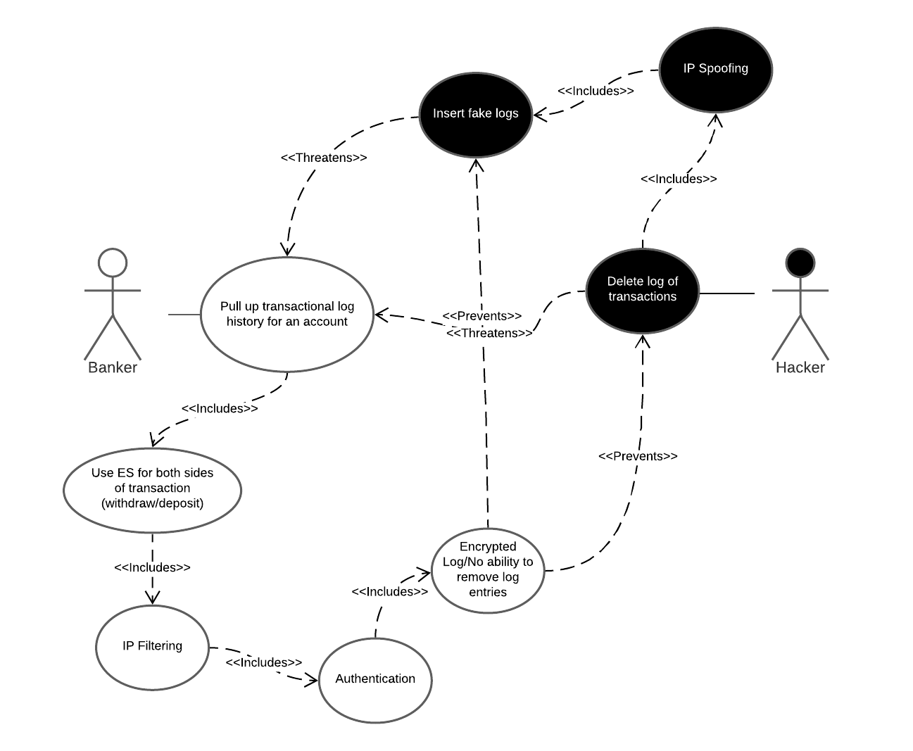

#Use Case #5

**Use Case:** The banker pulls up the transactional log history for a customer account.

**Description:** The use case is for a log of all transactions historically that happen in the banks system. This log would include all deposits, withdrawals, transfers, etc. This use case would use ElasticSearch for both sides of the transactions. The use case includes IP filtering and authentication as a countermeasure to all tampering with logs. In addition, the use case also includes encrypted logs with no ability to remove log entries. 

**Misuse Case:** The misuse cases that would threaten the transactional log would be a hacker deleting the log of transactions, and/or inserting in fake log records.  Another attack would be the hacker spoofing their IP address to appear as a trusted user.

**Security Requirements:** 
- Use Elasticsearch [IP Filtering](https://www.elastic.co/guide/en/elasticsearch/reference/current/ip-filtering.html) as a counter measure to all tampering with logs.
- Use Elasticsearch [Log Monitoring](https://www.elastic.co/log-monitoring) to monitor all withdraw and deposit transactions.
- Use Elasticsearch [Encrypting Communications](https://www.elastic.co/guide/en/elasticsearch/reference/current/configuring-tls.html#:~:text=Elastic%20Stack%20security%20features%20enable,in%20plain%20text%20including%20passwords.) to encrypt traffic to and from the Elasticsearch clusters.
- Use Elasticsearch [User Authentication](https://www.elastic.co/guide/en/elasticsearch/reference/current/setting-up-authentication.html) to try to prevent IP spoofing.

**Assessment:** Elasticsearch provides the necessary features to ensure secure logging of all transactions in the system.
