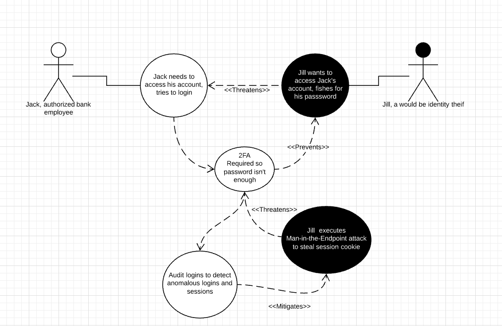

**Use Case:** Access Employee Account

  

**Description:** Bank employees need to be able to login to their accounts so that they can perform their job functions.

  

**Misuse Case:** An identity thief will want to try to steal an authorized users' credentials so they can access the authorized user's account. The identity thief could be an external actor or an internal malicious employee.

  

**Security Requirements:**

- Use Elasticsearch [2-Factor Authentication](https://www.elastic.co/guide/en/cloud/current/ec-account-user-settings.html#ec-account-security-mfa) to prevent unauthorized users from accessing an account with just the password.
- Use Elasticsearch [Security Logging](https://www.elastic.co/guide/en/elasticsearch/reference/current/enable-audit-logging.html) to detect anomalous logins and sessions.

**Assessment:** Elasticsearch provides the necessary features in order to prevent unauthorized access to employee accounts from both external and internal identity thieves.