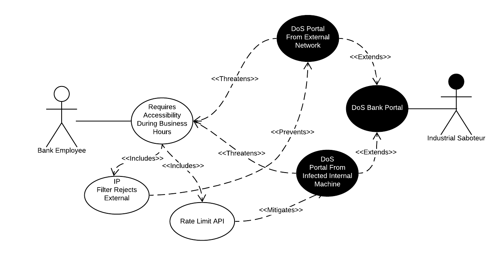

# Use Case #3

**Use Case:** Accessibility During Business Hours

**Description:** Bank employees require prompt responses from the system during business hours to perform requested actions. Requests must be serviced promptly.

**Misuse Case:** An industrial sabotuer working for a competitor is likely to attempt a Denial-of-Service attack during peak business hours to thwart regular business.

**Security Requirements:**
 - Use Elasticsearch [IP Filtering](https://www.elastic.co/guide/en/elasticsearch/reference/current/ip-filtering.html) to prevent external requests (that are likley part of a probing or DoS attempt)
 - Use Elasticsearch [Rate Limiting](https://www.elastic.co/guide/en/cloud/current/ec-api-rate-limiting.html) to further mitigate DoS attempts including those originating from a compromised internal machine.
 
 **Assessment:** Elasticsearch provides the necessary features to ensure accessibility to resources especially during required times.